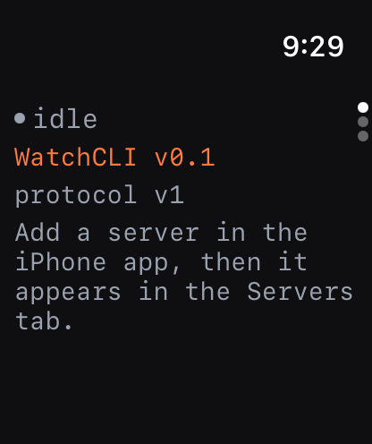
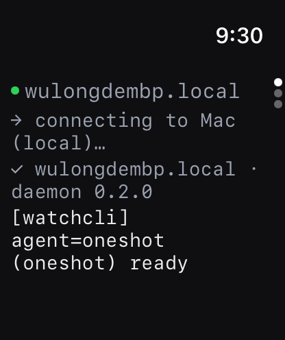

# WatchCLI

> AI Agent CLI on your Apple Watch. Code anytime.

A SwiftUI watchOS terminal client + companion iOS app + small Swift daemon
that lets you drive a real shell or AI CLI (Claude Code, Copilot CLI, …)
running on your Mac, workstation or server — straight from your wrist, by
**voice or touch**.

Inspired by the Claude Code CLI; designed for the watch, not ported to it.

| Empty state | Live session |
|:---:|:---:|
|  |  |

## Architecture

```
 ┌──────────────┐  WebSocket / TLS + bearer token  ┌──────────────────────┐
 │ watchOS app  │ ◄──────────────────────────────► │ watchcli-daemon      │
 │ (SwiftUI)    │                                  │ (Swift, Hummingbird) │
 └──────┬───────┘                                  │  ├─ PTY agents       │
        │ WatchConnectivity                        │  │   shell / claude  │
 ┌──────▼───────┐                                  │  │   / copilot       │
 │ iOS app      │  push endpoints to watch         │  ├─ oneshot agent    │
 │ (SwiftUI)    │  via applicationContext          │  └─ Token auth       │
 └──────────────┘                                  └──────────────────────┘
```

Modules in this repo (one root `Package.swift`):

| Module               | Kind        | Purpose                                          |
| -------------------- | ----------- | ------------------------------------------------ |
| `WatchCLIProtocol`   | library     | Codable wire types, `LineSplitter`, `CommandHistory` |
| `CWatchCLIPTY`       | C library   | Tiny `forkpty(3)` / `TIOCSWINSZ` / `waitpid` shim |
| `WatchCLIDaemon`     | executable  | Hummingbird WS server you run on your Mac/box   |
| watchOS / iOS apps   | xcodegen    | Clients (under `Apps/`)                         |

## Features

- **Bearer-token auth** with constant-time compare; token is generated on
  first launch and persisted at `~/.config/watchcli/token` (mode 0600).
- **Three agents out of the box**:
  - `shell` — a real interactive `$SHELL -i` over a PTY
  - `claude` — interactive Claude Code CLI over a PTY
  - `copilot` — interactive GitHub Copilot CLI over a PTY
  - `oneshot` — non-interactive `$SHELL -c <line>` per `input` (great for tests)
- **Watch UI** is a 3-page vertical TabView: Output / Compose / Servers.
  - Status pill (idle / connecting / connected / disconnected) with hostname
  - ANSI escape stripping so prompts stay readable
  - Per-stream colors (stdout / stderr / system / prompt)
  - Auto-scroll to bottom; 500-line history cap
- **Compose** has a focusable TextField (taps the watchOS dictation/scribble
  UI), a slash-command palette, a persisted command history, and an
  Interrupt button that sends SIGINT.
- **Reconnect with exponential backoff** (1, 2, 4, 8, 16, 30 s) on
  unexpected disconnect; user-initiated disconnects don't reconnect.
- **Haptics** on connect (success), exit (notification), disconnect (failure),
  send (click).
- **iOS companion** manages endpoints with full CRUD + secure-field token
  storage; pushes the latest set to the watch via
  `WCSession.updateApplicationContext`.

## Requirements

- macOS 14+, Xcode 16+ (developed against Xcode 26.5)
- [`xcodegen`](https://github.com/yonaskolb/XcodeGen): `brew install xcodegen`

## Quick start

```bash
# 1. Build everything (regenerates the Xcode project)
./scripts/build.sh

# 2. Run all tests (39 of them)
./scripts/test.sh

# 3. Start the daemon on your Mac — prints the token on first launch
./scripts/run-daemon.sh

# 4. Install on your real iPhone + paired Apple Watch
./scripts/install-on-device.sh        # see Docs/INSTALL_ON_DEVICE.md
```

In the iPhone app, add an endpoint:
- **URL** = `ws://<your-mac-IP>:8765/v1/session`
- **Token** = whatever the daemon printed on launch
- **Default agent** = `shell`, `claude`, `copilot`, or `oneshot`

The endpoint syncs to the watch automatically. Pick it in the watch's
Servers tab; dictate a command in Compose; watch the output stream into
the Terminal pane in real time.

## Status

| Phase | Scope | Result |
|------:|-------|:------:|
| **P1** | SwiftPM + xcodegen scaffolding, protocol v1 | ✅ |
| **P2** | Daemon: token auth, WS, oneshot command runner | ✅ |
| **P3** | Watch ↔ daemon connection, terminal pane | ✅ |
| **P4** | Dictation focus, persisted command history | ✅ |
| **P5** | iOS ↔ watch endpoint sync via WatchConnectivity | ✅ |
| **P6** | PTY agents, ANSI strip, reconnect/backoff, haptics | ✅ |

27 unit + integration tests passing (`swift test`), including a real
end-to-end PTY test that drives `/bin/sh -i` through the wire protocol.

## License

MIT. See [`LICENSE`](LICENSE).
